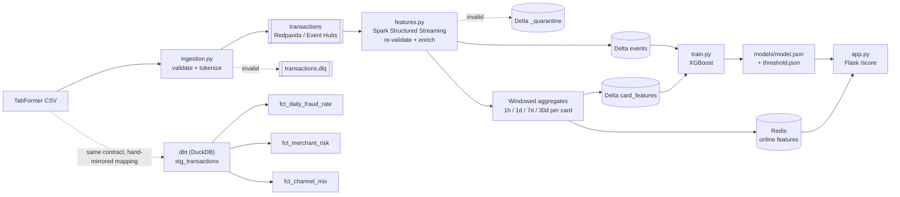

# Financial Payments Fraud Pipeline

A streaming, orchestrated fraud-detection pipeline over IBM's TabFormer synthetic credit-card transactions: contract-validated Kafka ingestion, Spark Structured Streaming windowed feature engineering with an online (Redis) / offline (Delta Lake) split, an XGBoost fraud classifier, and a latency-measured Flask scoring API — deployed to Azure Container Apps via Terraform. Built to demonstrate real streaming data-engineering discipline (schemas, train/serve-skew prevention, measured latency, IaC, teardown), not a static notebook.

## Problem
Card-issuer fraud teams need a decision — approve or hold for review — in milliseconds, at the moment of authorization, using only what's known about a card's recent behavior plus the transaction itself. That means the hard part isn't the model; it's the pipeline: validating events at the door, computing point-in-time-correct behavioral features (a card's transaction velocity, spend, and decline pattern over the last hour/day/7 days/30 days) without ever leaking the future into a feature, keeping the exact same feature logic online (serving) and offline (training), and serving a score under a tight latency budget. This project builds that pipeline end-to-end.

## Data
- **Source:** [IBM TabFormer](https://github.com/IBM/TabFormer) — large-scale (24M+ row) realistic *synthetic* credit-card transaction data, released by IBM for fraud-detection research. No real cardholders, no real PANs.
- **Access:** open, no credentialing needed; distributed via Git LFS. Run `python scripts/get_data.py --all` to download the full archive to `data/raw/` (git-ignored, ~2.3GB extracted) and carve the committed local-dev sample.
- **Size/shape:** full dataset is ~24M transactions, 2010–2019, ~2,000 synthetic users/cards. The committed sample, `data/sample/transactions_sample.csv` (76,989 rows / 7.1MB), is carved at the *user* level — 100 users' full transaction sequences kept intact (required for realistic windowed features), biased toward fraud-affected users, seed=42 for reproducibility.

## Architecture



Full lineage detail (including the DLQ/quarantine dead-letter paths and exactly which module owns which mapping) is in [`docs/governance/lineage.md`](docs/governance/lineage.md). Field-level definitions are in [`docs/governance/data-dictionary.md`](docs/governance/data-dictionary.md). The data contract itself is [`contracts/transaction.schema.json`](contracts/transaction.schema.json). Key architecture decisions and their rationale are in [`docs/adr/0001-stack-and-architecture.md`](docs/adr/0001-stack-and-architecture.md).

## Key Results

### Model (XGBoost, threshold chosen from the precision-recall curve)

Trained on the full dataset (11.9M rows, 2013–2019, time-based train/valid/test split, ~0.13% fraud base rate). Metrics below are on the held-out chronological test fold (2.38M rows); full detail including the tuning history is in `models/metrics.json`.

| Metric | Value |
|---|---|
| PR-AUC | 0.0227 (v1 feature set: 0.0029 — the 1h/1d/7d/30d density-matched windows are the difference) |
| ROC-AUC | 0.768 |
| Precision @ top-0.1% of scores | 0.045 (~34× lift over the 0.13% base rate — the ops-relevant number for a fixed review budget) |
| Precision @ threshold | 0.0065 |
| Recall @ threshold | 0.179 |
| Chosen threshold | 0.0412 (max-F1 on the validation PR curve) |
| Confusion matrix (tn/fp/fn/tp) | 2,290,089 / 87,226 / 2,611 / 568 |

At a ~0.13% base rate, absolute precision is inherently low at any recall-bearing threshold; the ranking metrics (PR-AUC, precision@top-k) are the honest measure, and both improved ~8–34× over the v1 feature set after root-causing the near-empty 1m/10m/1h windows (TabFormer cards transact roughly daily).

### API latency (local, measured with `scripts/benchmark.py`)

Two scenarios against the Dockerized Flask `/score` endpoint. **Warm** is the representative steady-state number: the full compose stack running, every benchmark card's `features:*` hash populated in Redis by the streaming job, so each request pays the real feature-join + model-predict path. **Cold** is the conservative baseline where every card misses Redis (zero-history fallback).

| Scenario | n | conc. | Throughput | p50 | p95 | p99 | errors |
|---|---|---|---|---|---|---|---|
| Warm Redis (steady state) | 2,000 | 8 | 1,237 req/s | 6.26 ms | 7.67 ms | 10.84 ms | 0 |
| Cold (no online features) | 500 | 4 | 1,884 req/s | 1.87 ms | 2.25 ms | 9.90 ms | 0 |

Both are single-container Flask+gunicorn on a laptop (Colima VM) — comfortably inside a ~50ms authorization budget with headroom for network hops.

## How to Run Locally

```bash
git clone https://github.com/<your-username>/financial-payments-fraud-pipeline.git
cd financial-payments-fraud-pipeline

# 1. Get the data (full download + committed sample; sample is already in git)
python scripts/get_data.py --all   # optional if you only need the committed sample

# 2. Bring up the core stack: Redpanda (Kafka), Redis, Spark streaming job, API
docker compose -f docker/docker-compose.yml up --build

# 3. Create the topics (first run only — rpk in current images has no auto-create flag)
docker exec redpanda rpk topic create transactions transactions.dlq

# 4. In a second terminal, replay the sample CSV onto Kafka (opt-in profile)
docker compose -f docker/docker-compose.yml --profile replay up producer

# 5. Score a transaction
curl -X POST http://localhost:8000/score -H 'Content-Type: application/json' -d '{...}'
```

- Copy `.env.example` to `.env` and adjust (`TOKENIZATION_SALT`, `PRODUCER_EVENTS_PER_SEC`, etc.) before running compose if you need non-default settings.
- `make check` (lint + tests + dbt build + terraform validate + compose config validate) is the pre-push gate; see `Makefile`/`scripts/check.sh`.
- To run the analytics layer standalone: `cd dbt && ../.venv/bin/dbt build --profiles-dir .` (builds against the committed sample CSV, no live services required).

## How to Deploy (Azure)

```bash
cd infra/terraform
./deploy.sh      # terraform apply (RG, Event Hubs Standard, ACR, Container Apps env)
                 # + az acr build (api + pipeline images) + point the Container App at the built image
```

Requires `az login` already done and Terraform installed; `deploy.sh` resolves all paths relative to the repo root. Tear down with:

```bash
cd infra/terraform
./destroy.sh
```

Event Hubs **Standard** tier (required for the Kafka-compatible endpoint) is the dominant recurring cost (~$25–30/month while provisioned) — run `destroy.sh` when not actively demoing. See `docs/adr/0001-stack-and-architecture.md` for the full cost/consequence writeup.

## Tech Stack
- **Language:** Python 3.11 (pinned via `uv`-managed venv — system Python 3.14 is unsupported by PySpark 3.5)
- **Streaming broker:** Kafka protocol — Redpanda (single container) locally, Azure Event Hubs Standard in the cloud; one client codebase, env-driven SASL config
- **Stream processing:** Spark Structured Streaming (PySpark 3.5.1)
- **Storage:** Delta Lake 3.2.0 (offline events/features, ACID + time travel), Redis 7 (online feature store)
- **Model:** XGBoost 2.1.1 binary classifier, `scale_pos_weight`-adjusted for the ~0.1% fraud base rate, time-based train/valid/test split, threshold selected from the precision-recall curve
- **Serving:** Flask 3.0.3 + gunicorn, Prometheus metrics (`/metrics`), soft-dependency Redis (never 500s on Redis failure — falls back to `cold_card: true`)
- **Analytics:** dbt-duckdb 1.8.3 (DuckDB target locally over the sample CSV; models portable to Databricks SQL)
- **IaC:** Terraform (`azurerm` provider) — Event Hubs, ACR, Log Analytics, Container Apps environment/app; `terraform destroy` tested as part of the Definition of Done
- **Containerization:** Docker (`docker/docker-compose.yml` for local dev, separate `Dockerfile.api` / `Dockerfile.pipeline` images), Azure Container Apps for cloud deployment
- **Governance:** JSON-Schema data contract (`contracts/`), producer + in-stream re-validation with DLQ/quarantine dead-letter paths, salted-SHA-256 PAN tokenization, dbt tests as quality gates, data-dictionary/lineage/tokenization-policy docs (`docs/governance/`)

## What I'd Improve Next
- **Warm-Redis latency benchmark.** The only latency number in this README today is the cold-path (every card missing from Redis) baseline — the number that actually matters for production capacity planning is steady-state, with realistic Redis hit rates.
- **dbt-over-DuckDB vs. a real warehouse.** The dbt project reads the sample CSV directly (via DuckDB's `read_csv_auto`), and `stg_transactions.sql` hand-mirrors `ingestion.py::to_event()`'s mapping logic in SQL rather than sharing one implementation — SQL can't import the Python module, so the two can drift if one changes without the other. On Databricks SQL, this staging model would instead read the same Delta tables the streaming job already writes, eliminating the duplication entirely.
- **Single-node streaming.** Redpanda and the Spark job both run as single instances locally; there's no tested failover/rebalance story, and Spark's `foreachBatch` Redis writes are not currently idempotent under retry (a replayed microbatch after a crash could double-count a window's contribution if the same batch is retried non-atomically).
- **Synthetic data ceiling.** TabFormer is realistic but synthetic — fraud patterns, MCC distributions, and cross-border behavior are generator artifacts, not real adversarial behavior; a production model would need real (or at minimum adversarially-validated) data before any deployment decision.
- **No feature drift/monitoring.** There's no automated check that the Redis-served features and the Delta/offline features stay in agreement in production (the train/serve-skew *prevention* mechanism — one shared `features.py` module — exists, but there's no *detection* mechanism for the day it silently breaks anyway, e.g. a stale Redis hash after a schema change).
