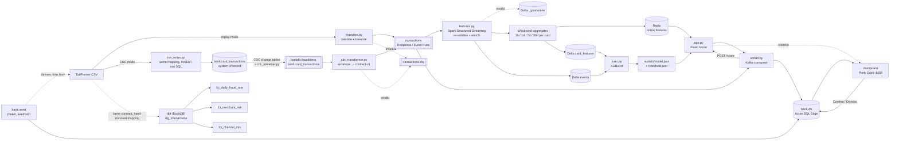

# Financial Payments Fraud Pipeline

A streaming, orchestrated fraud-detection pipeline over IBM's TabFormer synthetic credit-card transactions: contract-validated Kafka ingestion, Spark Structured Streaming windowed feature engineering with an online (Redis) / offline (Delta Lake) split, an XGBoost fraud classifier, and a latency-measured Flask scoring API — deployed to Azure Container Apps via Terraform. Built to demonstrate real streaming data-engineering discipline (schemas, train/serve-skew prevention, measured latency, IaC, teardown), not a static notebook.

## Problem
Card-issuer fraud teams need a decision — approve or hold for review — in milliseconds, at the moment of authorization, using only what's known about a card's recent behavior plus the transaction itself. That means the hard part isn't the model; it's the pipeline: validating events at the door, computing point-in-time-correct behavioral features (a card's transaction velocity, spend, and decline pattern over the last hour/day/7 days/30 days) without ever leaking the future into a feature, keeping the exact same feature logic online (serving) and offline (training), and serving a score under a tight latency budget. This project builds that pipeline end-to-end.

## Data
- **Source:** [IBM TabFormer](https://github.com/IBM/TabFormer) — large-scale (24M+ row) realistic *synthetic* credit-card transaction data, released by IBM for fraud-detection research. No real cardholders, no real PANs.
- **Access:** open, no credentialing needed; distributed via Git LFS. Run `python scripts/get_data.py --all` to download the full archive to `data/raw/` (git-ignored, ~2.3GB extracted) and carve the committed local-dev sample.
- **Size/shape:** full dataset is ~24M transactions, 2010–2019, ~2,000 synthetic users/cards. The committed sample, `data/sample/transactions_sample.csv` (76,989 rows / 7.1MB), is carved at the *user* level — 100 users' full transaction sequences kept intact (required for realistic windowed features), biased toward fraud-affected users, seed=42 for reproducibility.

## Architecture



Full lineage detail (including the DLQ/quarantine dead-letter paths, the bank-DB read/write paths, and exactly which module owns which mapping) is in [`docs/governance/lineage.md`](docs/governance/lineage.md). Field-level definitions — including the `bank.*` tables — are in [`docs/governance/data-dictionary.md`](docs/governance/data-dictionary.md). The data contract itself is [`contracts/transaction.schema.json`](contracts/transaction.schema.json). Key architecture decisions and their rationale are in [`docs/adr/0001-stack-and-architecture.md`](docs/adr/0001-stack-and-architecture.md) (core stack) and [`docs/adr/0002-bank-scorer-dashboard.md`](docs/adr/0002-bank-scorer-dashboard.md) (bank DB / scorer loop / dashboard), and [`docs/adr/0003-cdc-ingestion.md`](docs/adr/0003-cdc-ingestion.md) (CDC ingestion and delivery semantics).

## Key Results

### Model (XGBoost, threshold chosen from the precision-recall curve)

Trained on the full dataset (11.9M rows, 2013–2019, time-based train/valid/test split, ~0.13% fraud base rate). Metrics below are on the held-out chronological test fold (2.38M rows); full detail including the tuning history is in `models/metrics.json`.

| Metric | Value |
|---|---|
| PR-AUC | 0.0227 (v1 feature set: 0.0029 — the 1h/1d/7d/30d density-matched windows are the difference) |
| ROC-AUC | 0.768 |
| Precision @ top-0.1% of scores | 0.045 (~34× lift over the 0.13% base rate — the ops-relevant number for a fixed review budget) |
| Precision @ threshold | 0.0065 |
| Recall @ threshold | 0.179 |
| Chosen threshold | 0.0412 (max-F1 on the validation PR curve) |
| Confusion matrix (tn/fp/fn/tp) | 2,290,089 / 87,226 / 2,611 / 568 |

At a ~0.13% base rate, absolute precision is inherently low at any recall-bearing threshold; the ranking metrics (PR-AUC, precision@top-k) are the honest measure, and both improved ~8–34× over the v1 feature set after root-causing the near-empty 1m/10m/1h windows (TabFormer cards transact roughly daily).

### API latency (local, measured with `scripts/benchmark.py`)

Two scenarios against the Dockerized Flask `/score` endpoint. **Warm** is the representative steady-state number: the full compose stack running, every benchmark card's `features:*` hash populated in Redis by the streaming job, so each request pays the real feature-join + model-predict path. **Cold** is the conservative baseline where every card misses Redis (zero-history fallback).

| Scenario | n | conc. | Throughput | p50 | p95 | p99 | errors |
|---|---|---|---|---|---|---|---|
| Warm Redis (steady state) | 2,000 | 8 | 1,237 req/s | 6.26 ms | 7.67 ms | 10.84 ms | 0 |
| Cold (no online features) | 500 | 4 | 1,884 req/s | 1.87 ms | 2.25 ms | 9.90 ms | 0 |

Both are single-container Flask+gunicorn on a laptop (Colima VM) — comfortably inside a ~50ms authorization budget with headroom for network hops.

Deployed to Azure Container Apps (eastus2, 0.5 vCPU / 1Gi), the same benchmark measured cross-internet from a laptop: p50 147 ms / p95 282 ms / p99 290 ms at 21.8 req/s, 0 errors — the server-side scoring path (reported per-response as `latency_ms`) stayed at ~2–3 ms, so the gap is network RTT + TLS to the region, not the pipeline. The deployment was verified live and then torn down (`destroy.sh`) to stop the ~$40/mo Event Hubs Standard + Container Apps spend; `deploy.sh` recreates it in ~15 minutes.

## How to Run Locally

```bash
git clone https://github.com/<your-username>/financial-payments-fraud-pipeline.git
cd financial-payments-fraud-pipeline

# 1. Get the data (full download + committed sample; sample is already in git)
python scripts/get_data.py --all   # optional if you only need the committed sample

# 2. Bring up the core stack: Redpanda (Kafka), Redis, Spark streaming job, API
docker compose -f docker/docker-compose.yml up --build

# 3. Create the topics (first run only — rpk in current images has no auto-create flag)
docker exec redpanda rpk topic create transactions transactions.dlq

# 4. In a second terminal, replay the sample CSV onto Kafka (opt-in profile)
docker compose -f docker/docker-compose.yml --profile replay up producer

# 5. Score a transaction
curl -X POST http://localhost:8000/score -H 'Content-Type: application/json' -d '{...}'
```

- Copy `.env.example` to `.env` and adjust (`TOKENIZATION_SALT`, `PRODUCER_EVENTS_PER_SEC`, etc.) before running compose if you need non-default settings.
- `make check` (lint + tests + dbt build + terraform validate + compose config validate) is the pre-push gate; see `Makefile`/`scripts/check.sh`.
- To run the analytics layer standalone: `cd dbt && ../.venv/bin/dbt build --profiles-dir .` (builds against the committed sample CSV, no live services required).

## Run the Demo

The steps above bring up the core streaming path only. `make demo` additionally brings up the v1.1 pieces — a core-banking system-of-record (Azure SQL Edge), a live scorer loop, and a fraud-ops dashboard — so a fresh clone goes from `git clone` to a live, alert-generating dashboard with **one command and zero manual steps**:

```bash
git clone https://github.com/<your-username>/financial-payments-fraud-pipeline.git
cd financial-payments-fraud-pipeline
make demo
```

`scripts/demo.sh` (idempotent — safe to re-run while already up) does everything: builds/starts the core stack + `bank-db`, creates the Kafka topics, seeds the bank DB (`src/bank/seed.py`, deterministic Faker-synthetic customers/accounts/cards derived from `data/sample/transactions_sample.csv`), and starts the scorer loop, dashboard, and replay producer. On a warm image cache this completes in well under 5 minutes end to end, with alerts already flowing by the time it prints:

```
  Dashboard : http://localhost:8050
  API       : http://localhost:8000/healthz
  Metrics   : http://localhost:8000/metrics
```

Give the dashboard ~10–20s after that to show its first live data. Tear everything down with `make demo-down` (or `make demo-down-volumes` to also drop the bank DB's persisted data for a fully clean-state re-test).

### CDC mode — the production-real ingest (v1.2)

```bash
make demo-cdc
```

Same dashboard, same scorer, same API — but the ingest is how a real bank does it: transactions are INSERTed into `bank.card_transactions` (the OLTP system of record), SQL Server **Change Data Capture** picks them off the transaction log into change tables, a streamer emits the change feed onto Kafka in **Debezium's envelope format**, and a thin transformer (`src/pipeline/cdc_transformer.py`) maps it back onto the same contract-v1 `transactions` topic — so everything downstream is byte-identical between modes. The CSV never touches Kafka directly in this mode; measured insert→scored end-to-end latency is ~1.2s. Delivery is explicitly at-least-once with commit-after-flush offset boundaries at every consumer (the streamer's LSN offset lives in SQL, written only after the producer flush), deduped to effectively-once in SQL by the `event_id` primary key — kill the streamer mid-run and it resumes from its LSN without losing rows or duplicating any.

One honest caveat, documented in [`docs/adr/0003-cdc-ingestion.md`](docs/adr/0003-cdc-ingestion.md): the change feed is emitted by `src/pipeline/cdc_streamer.py`, not by Debezium itself — Azure SQL Edge (the only ARM-native SQL Server image) has CLR permanently disabled, and Debezium's streaming loop needs the CLR-backed `sys.fn_cdc_increment_lsn` on every iteration (its snapshot works; streaming then fails forever — found live). The streamer reads the same log-derived change tables, re-implements that one function (10 bytes of big-endian arithmetic), and emits byte-compatible envelopes — a round-trip unit test pins that the transformer can't tell the difference. The real Debezium Connect service + connector config ship in the repo under the opt-in `debezium` compose profile as the drop-in for full SQL Server / Azure SQL, where the Agent and CLR exist. The same ADR covers the other Edge caveat: no SQL Server Agent, so a `sp_cdc_scan` pump service replaces the capture job.

*(Screenshot placeholder — drop a dashboard screen-share capture at `docs/img/dashboard.png` and reference it here: ``)*

### Observability mode — watching the pipeline, not just measuring it (v1.3)

```bash
make demo-cdc OBS=1     # or: make demo OBS=1
```

`OBS=1` layers a Prometheus + Grafana stack (compose profile `obs`) onto either demo mode, fully provisioned as code — datasource, dashboard JSON, and alert rules all live in [`docker/observability/`](docker/observability/), so there is zero clickops and nothing to lose on `make demo-down-volumes`:

- **Grafana** ([http://localhost:3000/d/fraud-ops](http://localhost:3000/d/fraud-ops), anonymous viewer): consumer lag per group, scoring throughput and alert rate, p50/p95/p99 score latency from the API's histogram, scoring staleness, backend health.
- **Prometheus** ([http://localhost:9090](http://localhost:9090)): scrapes the API's existing `/metrics` plus a hand-rolled exporter; alert rules as code (`ConsumerLagHigh`, `ScoringStale`, `TargetDown`, `ExporterBackendDown`) load and fire in the UI — no Alertmanager yet, a documented gap.
- **Lag exporter** (`src/pipeline/lag_exporter.py`, [:9105/metrics](http://localhost:9105/metrics)): `kafka_consumergroup_lag{group,topic,partition}` (committed offset vs high watermark — deliberately hand-rolled, the mechanics are the point), `bank_rows_total{table}`, and `scoring_staleness_seconds` — so one target answers both "is Kafka backing up?" and "is anything landing in SQL?". Rationale in [`docs/adr/0004-observability.md`](docs/adr/0004-observability.md).

The demo beat this exists for: `docker kill scorer` → watch the scorer group's lag line climb on the Grafana board while staleness rises (and the `ConsumerLagHigh` alert arms) → `docker start scorer` → lag drains visibly back to zero. That's v1.2's commit-after-flush delivery semantics, made observable.

### The 3-minute recruiter demo script

A talk track for walking someone through `make demo` live, panel by panel.

**0:00 — Open with the shape of the problem (10s).** *"This is a fraud-ops console sitting on top of a streaming pipeline — TabFormer credit-card transactions are being replayed onto Kafka right now, scored in real time by a Flask API, and everything you're about to see updates every two seconds with zero manual refresh."*

**0:10 — Header stat tiles (20s).** *"Top row: transactions scored — the total and the last-60-second rate, so you can see it's live, not a static snapshot. Open alerts — the analyst's queue. Scoring latency — p50/p95/p99, parsed straight off the API's Prometheus `/metrics`, because a fraud score that arrives after the authorization decision is worthless. And the model card — PR-AUC and ROC-AUC from the actual training run, not a claimed number."*

**0:30 — Live feed + score distribution (30s).** *"Live scored transactions on the left is the last ~20 events landing in `bank.scored_transactions` — masked card token, merchant, amount, score, decision. Score distribution is log-scale on purpose: fraud is rare, so almost everything piles up near zero and you'd never see the tail on a linear axis."*

**1:00 — The suspicious-transaction moment (30s).** *"Watch the Open fraud alerts panel — when a replayed transaction crosses the model's threshold, it shows up here within a couple seconds, joined all the way back to the customer: name, risk tier, credit limit, the actual merchant and amount. This is `bank.fraud_alerts` joined to `bank.cards → accounts → customers` live. As an analyst I can click **Confirm fraud** or **Dismiss** right here — that's a real SQL `UPDATE` on `status`/`reviewed_at`, not a mock button; refresh and the state's still there."*

**1:30 — Kill-redis resilience beat (45s).** *"Now watch the Cold-card share chart while I do this: `docker kill redis`."* (run it) *"Redis is the online feature store — when it's unreachable, the scoring API doesn't fall over, it falls back to zero-history features and marks the response `cold_card: true`. Watch this line climb toward 100% over the next few refreshes — that's the pipeline degrading gracefully instead of throwing 500s. Bring Redis back —"* (`docker start redis` / `docker compose up -d redis`) *"— and it recovers on its own, no restart needed anywhere else."*

**2:15 — Throughput + alert mix (20s).** *"Throughput over the last 30 minutes, and the alert mix by channel and MCC group — which spend categories and card-present-vs-not patterns are actually driving the queue right now."*

**2:35 — Close on cost and teardown (25s).** *"Everything you just watched runs entirely local — Docker Compose, `make demo`, $0. The same stack has an optional Terraform module to put this dashboard behind a public URL on Azure SQL serverless + Container Apps for about $1.50–2.50 a day while it's up, and it tears down cleanly with one command — same discipline as the rest of this project: nothing runs, and nothing bills, when nobody's looking at it."*

## How to Deploy (Azure)

```bash
cd infra/terraform
./deploy.sh      # terraform apply (RG, Event Hubs Standard, ACR, Container Apps env)
                 # + az acr build (api + pipeline images) + point the Container App at the built image
```

Requires `az login` already done and Terraform installed; `deploy.sh` resolves all paths relative to the repo root. Tear down with:

```bash
cd infra/terraform
./destroy.sh
```

Event Hubs **Standard** tier (required for the Kafka-compatible endpoint) is the dominant recurring cost (~$25–30/month while provisioned) — run `destroy.sh` when not actively demoing. See `docs/adr/0001-stack-and-architecture.md` for the full cost/consequence writeup.

## Tech Stack
- **Language:** Python 3.11 (pinned via `uv`-managed venv — system Python 3.14 is unsupported by PySpark 3.5)
- **Streaming broker:** Kafka protocol — Redpanda (single container) locally, Azure Event Hubs Standard in the cloud; one client codebase, env-driven SASL config
- **Stream processing:** Spark Structured Streaming (PySpark 3.5.1)
- **Storage:** Delta Lake 3.2.0 (offline events/features, ACID + time travel), Redis 7 (online feature store)
- **Model:** XGBoost 2.1.1 binary classifier, `scale_pos_weight`-adjusted for the ~0.1% fraud base rate, time-based train/valid/test split, threshold selected from the precision-recall curve
- **Serving:** Flask 3.0.3 + gunicorn, Prometheus metrics (`/metrics`), soft-dependency Redis (never 500s on Redis failure — falls back to `cold_card: true`)
- **Analytics:** dbt-duckdb 1.8.3 (DuckDB target locally over the sample CSV; models portable to Databricks SQL)
- **IaC:** Terraform (`azurerm` provider) — Event Hubs, ACR, Log Analytics, Container Apps environment/app; `terraform destroy` tested as part of the Definition of Done
- **Containerization:** Docker (`docker/docker-compose.yml` for local dev, separate `Dockerfile.api` / `Dockerfile.pipeline` / `Dockerfile.dashboard` images), Azure Container Apps for cloud deployment
- **Governance:** JSON-Schema data contract (`contracts/`), producer + in-stream re-validation with DLQ/quarantine dead-letter paths, salted-SHA-256 PAN tokenization, dbt tests as quality gates, data-dictionary/lineage/tokenization-policy docs (`docs/governance/`)
- **System-of-record:** Azure SQL Edge (ARM-native, SQL Server-compatible) for `bank.*` — customers/accounts/cards dims plus `scored_transactions`/`fraud_alerts`, seeded deterministically from the sample CSV via Faker (seed=42); see `docs/adr/0002-bank-scorer-dashboard.md`
- **Live scorer loop:** `src/pipeline/scorer.py` — a Kafka consumer that calls the same `/score` endpoint the benchmark measures and writes results/alerts to the bank DB, keeping one single scoring code path
- **Dashboard:** Plotly Dash (pure Python, no CDN) fraud-ops console — live feed, alert queue with Confirm/Dismiss actions, latency/throughput/cold-card charts, `docker/Dockerfile.dashboard`

## What I'd Improve Next
- **Schema registry + typed events.** Events are loose JSON validated against a JSON-Schema contract at each boundary; the next step is Avro/Protobuf with a schema registry (Redpanda ships one) so contract evolution is enforced by the broker path itself rather than by convention. (CDC ingestion — the previous top item here — shipped in v1.2: `make demo-cdc`, ADR 0003.)
- **Warm-Redis latency benchmark.** The only latency number in this README today is the cold-path (every card missing from Redis) baseline — the number that actually matters for production capacity planning is steady-state, with realistic Redis hit rates.
- **dbt-over-DuckDB vs. a real warehouse.** The dbt project reads the sample CSV directly (via DuckDB's `read_csv_auto`), and `stg_transactions.sql` hand-mirrors `ingestion.py::to_event()`'s mapping logic in SQL rather than sharing one implementation — SQL can't import the Python module, so the two can drift if one changes without the other. On Databricks SQL, this staging model would instead read the same Delta tables the streaming job already writes, eliminating the duplication entirely.
- **Single-node streaming.** Redpanda and the Spark job both run as single instances locally; there's no tested failover/rebalance story, and Spark's `foreachBatch` Redis writes are not currently idempotent under retry (a replayed microbatch after a crash could double-count a window's contribution if the same batch is retried non-atomically).
- **Synthetic data ceiling.** TabFormer is realistic but synthetic — fraud patterns, MCC distributions, and cross-border behavior are generator artifacts, not real adversarial behavior; a production model would need real (or at minimum adversarially-validated) data before any deployment decision.
- **No feature drift/monitoring.** There's no automated check that the Redis-served features and the Delta/offline features stay in agreement in production (the train/serve-skew *prevention* mechanism — one shared `features.py` module — exists, but there's no *detection* mechanism for the day it silently breaks anyway, e.g. a stale Redis hash after a schema change).
